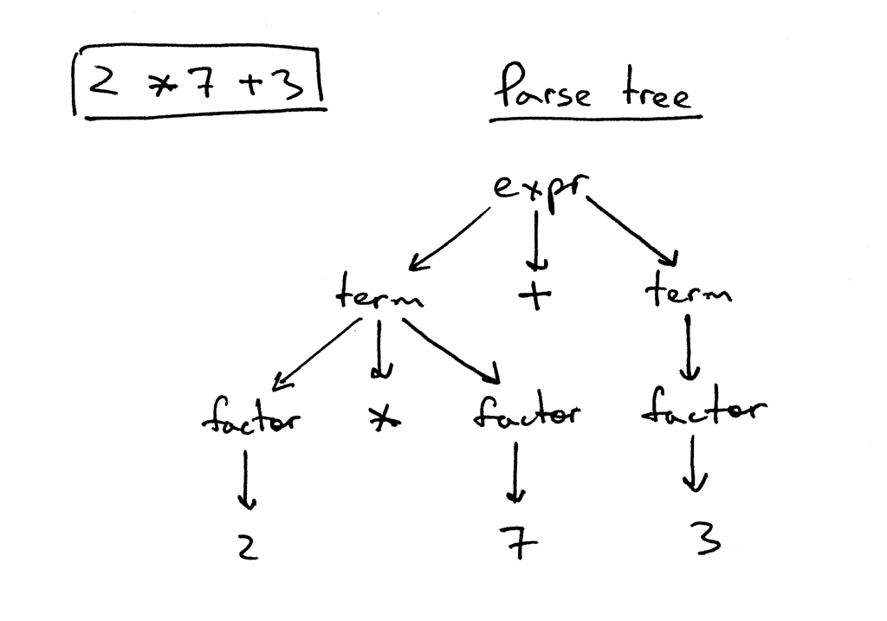

## 为什么要学编译器或者解释器

1. 本身编译器就是一种非常复杂的软件，学习编译器工作的原理可以帮助你掌握很多特殊的技能。

2. 当你了解编译原理之后，你就能非常容易的学习一门新的语言。

## 解释器和编译器的区别


编译器是将源码翻译成机器语言，之后再让机器运行。而解释器是将源码直接丢给解释器去解释执行。

我们目前只讨论interpreter，并且会探讨如何将一个pascal的源文件通过c/c++代码解释执行

## 考虑下面这个例子

```pascal
3+5
```

当你输入 **3+5**的时候，解释器第一步会将你的输入变成一组它能够理解的单词（token），一个单词指的是包含类型和值信息的对象，比如在这里，'3' 是一个单词，他的类型是'INTEGER'，值是'3'， '+' 是一个单词，他的类型是'PLUS'，值是'+'。

当字符流变为单词的过程，我们叫做词法分析（lexical analysis）。所以，我们解释器需要做的第一步就是词法分析。我们可以构建一个类叫做lexical analyzer来做这件事。为了简便也可以叫做lexer。不同的地方可能有不同的术语，比如scanner 或者 tokenizer。总之他们要表达的都是一个意思，就是要将字符流变成单词流。


经过了单词化，之后就是解释执行（我们先尽可能的把例子举的足够简单）。

解释执行需要依赖特定的语法，因此我们需要对语法进行精确的标记。业内用的最广泛的标记语法的方式叫做BNF或者叫做上下文无关文法（context-free grammars)。熟悉Unix系统的人肯定都已经用过，但是我们这里使用的可能更接近EBNF notation。

考虑四则运算表达式，我们可以用EBNF描述出如下的文法：
```
exp: term((PLUS|MINUS)term)*

term: factor((MUL|DIV)factor)*

factor: INTEGER
```

一个四则运算表达式是一个exp, exp由一个term或者一个term通过'+'或者'-'连接多个term而成，而一个term由一个factor通过'*'或者'/'连接多个factor而成，一个factor是最基础的操作数（运算子)，它是一个整数。

所以 **7+5*2**可以被表示为


```python
# Token types
#
# EOF (end-of-file) token is used to indicate that
# there is no more input left for lexical analysis
INTEGER, PLUS, MINUS, MUL, DIV, EOF = (
    'INTEGER', 'PLUS', 'MINUS', 'MUL', 'DIV', 'EOF'
)

class Token(object):
    def __init__(self, type, value):
        # token type: INTEGER, PLUS, MINUS, MUL, DIV, or EOF
        self.type = type
        # token value: non-negative integer value, '+', '-', '*', '/', or None
        self.value = value

class Lexer(object):
    def __init__(self, text):
        # client string input, e.g. "3 * 5", "12 / 3 * 4", etc
        self.text = text
        # self.pos is an index into self.text
        self.pos = 0
        self.current_char = self.text[self.pos]

    def error(self):
        raise Exception('Invalid character')

    def advance(self):
        """Advance the `pos` pointer and set the `current_char` variable."""
        self.pos += 1
        if self.pos > len(self.text) - 1:
            self.current_char = None  # Indicates end of input
        else:
            self.current_char = self.text[self.pos]

    def skip_whitespace(self):
        while self.current_char is not None and self.current_char.isspace():
            self.advance()

    def integer(self):
        """Return a (multidigit) integer consumed from the input."""
        result = ''
        while self.current_char is not None and self.current_char.isdigit():
            result += self.current_char
            self.advance()
        return int(result)

    def get_next_token(self):
        """Lexical analyzer (also known as scanner or tokenizer)

        This method is responsible for breaking a sentence
        apart into tokens. One token at a time.
        """
        while self.current_char is not None:

            if self.current_char.isspace():
                self.skip_whitespace()
                continue

            if self.current_char.isdigit():
                return Token(INTEGER, self.integer())

            if self.current_char == '+':
                self.advance()
                return Token(PLUS, '+')

            if self.current_char == '-':
                self.advance()
                return Token(MINUS, '-')

            if self.current_char == '*':
                self.advance()
                return Token(MUL, '*')

            if self.current_char == '/':
                self.advance()
                return Token(DIV, '/')

            self.error()

        return Token(EOF, None)


class Interpreter(object):
    def __init__(self, lexer):
        self.lexer = lexer
        # set current token to the first token taken from the input
        self.current_token = self.lexer.get_next_token()

    def error(self):
        raise Exception('Invalid syntax')

    def eat(self, token_type):
        # compare the current token type with the passed token
        # type and if they match then "eat" the current token
        # and assign the next token to the self.current_token,
        # otherwise raise an exception.
        if self.current_token.type == token_type:
            self.current_token = self.lexer.get_next_token()
        else:
            self.error()

    def factor(self):
        """factor : INTEGER"""
        token = self.current_token
        self.eat(INTEGER)
        return token.value

    def term(self):
        """term : factor ((MUL | DIV) factor)*"""
        result = self.factor()

        while self.current_token.type in (MUL, DIV):
            token = self.current_token
            if token.type == MUL:
                self.eat(MUL)
                result = result * self.factor()
            elif token.type == DIV:
                self.eat(DIV)
                result = result / self.factor()

        return result

    def expr(self):
        """Arithmetic expression parser / interpreter.

        calc>  14 + 2 * 3 - 6 / 2
        17

        expr   : term ((PLUS | MINUS) term)*
        term   : factor ((MUL | DIV) factor)*
        factor : INTEGER
        """
        result = self.term()

        while self.current_token.type in (PLUS, MINUS):
            token = self.current_token
            if token.type == PLUS:
                self.eat(PLUS)
                result = result + self.term()
            elif token.type == MINUS:
                self.eat(MINUS)
                result = result - self.term()

        return result


def main():
    while True:
        try:
            # To run under Python3 replace 'raw_input' call
            # with 'input'
            text = raw_input('calc> ')
        except EOFError:
            break
        if not text:
            continue
        lexer = Lexer(text)
        interpreter = Interpreter(lexer)
        result = interpreter.expr()
        print(result)


if __name__ == '__main__':
    main()
```

## 思考

- 如何支持一元运算符 (比如, 1 + -4)

- 如何支持 '('，'）'的优先级运算 (比如 2 * (3 + 2))

## 新的文法

```
exp: term((PLUS|MINUS)term)*

term: factor((MUL|DIV)factor)*

factor: INTEGER
      | +factor
      | -factor
      | (exp)
```

## 如果想更模块化一点呢

上面的例子我们可以看到，目前我们的代码将解析和执行都是放在一起。这种模式叫做直接语法解释器(semantic-directed interpreter)。他们适合去解释一些简单的应用。但是如果我们想要去实现更复杂的功能，我们需要构建一个中间表示(intermediate representation)，我们简称IR。parser负责构建IR，interpreter负责执行IR。

对于IR，我们通常都是使用tree去描述它。我们考虑下面这个例子


## Abstract-syntax tree (AST)

AST是比较常见的IR。但是我们先不讨论AST，我们可以看看解析树(parse-tree)。 可能有些地方叫做直接语法树（concrete semantic tree）



这一个直接语法树，我们可以得出以下几个结论：

1. 一个语法树记录了所有parser识别出来的记录

2. 树的根节点总是语法的开始符

3. 每个内部节点都是一个非终结符，在我们的例子里是expr, term, 或者factor

4. 每个叶子节点表示一个token

现在我们看看AST


我们可以得出如下几个结论

1. AST 直接使用操作符来作为内部以及根节点。这些操作符将配合它的子节点做运算

2. AST 不使用内部结点来表示语法规则。

3. AST 不表示语法规则的每个细节（因为这个它才被称作是抽象的）。它没有规则节点，没有父子关系。

4. 相对于直接语法树，抽象语法树用更少的节点以及层级结构去描述同一个语法结构。

所以到此我们可以总结一下，什么是抽象语法树。抽象语法树就是：使用内部节点以及根节点做操作符，子节点表示操作数的一种抽象与法数据结构。

我们可以看下具体的例子

```python
class AST(object):
    pass


class BinOp(AST):
    def __init__(self, left, op, right):
        self.left = left
        self.token = self.op = op
        self.right = right


class Num(AST):
    def __init__(self, token):
        self.token = token
        self.value = token.value


class Parser(object):
    def __init__(self, lexer):
        self.lexer = lexer
        # set current token to the first token taken from the input
        self.current_token = self.lexer.get_next_token()

    def error(self):
        raise Exception('Invalid syntax')

    def eat(self, token_type):
        # compare the current token type with the passed token
        # type and if they match then "eat" the current token
        # and assign the next token to the self.current_token,
        # otherwise raise an exception.
        if self.current_token.type == token_type:
            self.current_token = self.lexer.get_next_token()
        else:
            self.error()

    def factor(self):
        """factor : INTEGER | LPAREN expr RPAREN"""
        token = self.current_token
        if token.type == INTEGER:
            self.eat(INTEGER)
            return Num(token)
        elif token.type == LPAREN:
            self.eat(LPAREN)
            node = self.expr()
            self.eat(RPAREN)
            return node

    def term(self):
        """term : factor ((MUL | DIV) factor)*"""
        node = self.factor()

        while self.current_token.type in (MUL, DIV):
            token = self.current_token
            if token.type == MUL:
                self.eat(MUL)
            elif token.type == DIV:
                self.eat(DIV)

            node = BinOp(left=node, op=token, right=self.factor())

        return node

    def expr(self):
        """
        expr   : term ((PLUS | MINUS) term)*
        term   : factor ((MUL | DIV) factor)*
        factor : INTEGER | LPAREN expr RPAREN
        """
        node = self.term()

        while self.current_token.type in (PLUS, MINUS):
            token = self.current_token
            if token.type == PLUS:
                self.eat(PLUS)
            elif token.type == MINUS:
                self.eat(MINUS)

            node = BinOp(left=node, op=token, right=self.term())

        return node

    def parse(self):
        return self.expr()
```

剩下的问题就只剩下解析树了。我们采用后续遍历的方式去解析，也就是说先遍历子节点，最后才是根节点。


```python
class NodeVisitor(object):
    def visit(self, node):
        method_name = 'visit_' + type(node).__name__
        visitor = getattr(self, method_name, self.generic_visit)
        return visitor(node)

    def generic_visit(self, node):
        raise Exception('No visit_{} method'.format(type(node).__name__))

class Interpreter(NodeVisitor):
    def __init__(self, parser):
        self.parser = parser

    def visit_BinOp(self, node):
        if node.op.type == PLUS:
            return self.visit(node.left) + self.visit(node.right)
        elif node.op.type == MINUS:
            return self.visit(node.left) - self.visit(node.right)
        elif node.op.type == MUL:
            return self.visit(node.left) * self.visit(node.right)
        elif node.op.type == DIV:
            return self.visit(node.left) / self.visit(node.right)

    def visit_Num(self, node):
        return node.value
```

所以我们可以看到目前一个程序被执行大概经历下面几个步骤


# 解析pascal语法子集

考虑下面这个pascal文件

```pascal
BEGIN
    BEGIN
        number := 2;
        a := number;
        b := 10 * a + 10 * number / 4;
        c := a - - b
    END;
    x := 11;
END.
```

新的文法

```
program : compound_statement DOT

compound_statement : BEGIN statement_list END

statement_list : statement
               | statement SEMI statement_list

statement : compound_statement
          | assignment_statement
          | empty

assignment_statement : variable ASSIGN expr

empty :

expr: term ((PLUS | MINUS) term)*

term: factor ((MUL | DIV) factor)*

factor : PLUS factor
       | MINUS factor
       | INTEGER
       | LPAREN expr RPAREN
       | variable

variable: ID
```

注意，在statement_list里我们并没有用'*'来表示0或多个。这其实是另外一种表示0或多个的方式。这种方式通常在一些开源项目比如PLY里面被广泛的用到。我这么写的话可以帮助大家去理解PLY里面的文法。

同时修改lexer


目前我们使用的解析方式都是递归下降（recursive descent）的方式，因此不可避免的要进行回溯。考虑到赋值符号':='由两个符号表示，而 ':'还可以用于类型声明，所以当我们检测到':'符号的时候，需要peek下一个符号是否为'='来产生正确的单词。

```python
def peek(self):
    peek_pos = self.pos + 1
    if peek_pos > len(self.text) - 1:
        return None
    else:
        return self.text[peek_pos]

RESERVED_KEYWORDS = {
    'BEGIN': Token('BEGIN', 'BEGIN'),
    'END': Token('END', 'END'),
}

def _id(self):
    """Handle identifiers and reserved keywords"""
    result = ''
    while self.current_char is not None and self.current_char.isalnum():
        result += self.current_char
        self.advance()

    token = RESERVED_KEYWORDS.get(result, Token(ID, result))
    return token

def get_next_token(self):
    while self.current_char is not None:
        ...
        if self.current_char.isalpha():
            return self._id()

        if self.current_char == ':' and self.peek() == '=':
            self.advance()
            self.advance()
            return Token(ASSIGN, ':=')

        if self.current_char == ';':
            self.advance()
            return Token(SEMI, ';')

        if self.current_char == '.':
            self.advance()
            return Token(DOT, '.')
        # ...
```

我们看看如何修改Parser


```python
def program(self):
    """program : compound_statement DOT"""
    node = self.compound_statement()
    self.eat(DOT)
    return node

def compound_statement(self):
    """
    compound_statement: BEGIN statement_list END
    """
    self.eat(BEGIN)
    nodes = self.statement_list()
    self.eat(END)

    root = Compound()
    for node in nodes:
        root.children.append(node)

    return root

def statement_list(self):
    """
    statement_list : statement
                   | statement SEMI statement_list
    """
    node = self.statement()

    results = [node]

    while self.current_token.type == SEMI:
        self.eat(SEMI)
        results.append(self.statement())

    if self.current_token.type == ID:
        self.error()

    return results

def statement(self):
    """
    statement : compound_statement
              | assignment_statement
              | empty
    """
    if self.current_token.type == BEGIN:
        node = self.compound_statement()
    elif self.current_token.type == ID:
        node = self.assignment_statement()
    else:
        node = self.empty()
    return node

def assignment_statement(self):
    """
    assignment_statement : variable ASSIGN expr
    """
    left = self.variable()
    token = self.current_token
    self.eat(ASSIGN)
    right = self.expr()
    node = Assign(left, token, right)
    return node

def variable(self):
    """
    variable : ID
    """
    node = Var(self.current_token)
    self.eat(ID)
    return node

def empty(self):
    """An empty production"""
    return NoOp()


# ...
def factor(self):
    """factor : PLUS  factor
              | MINUS factor
              | INTEGER
              | LPAREN expr RPAREN
              | variable
    """
    token = self.current_token
    if token.type == PLUS:
        self.eat(PLUS)
        node = UnaryOp(token, self.factor())
        return node
    ...
    else:
        node = self.variable()
        return node


# ...
def parse(self):
    node = self.program()
    if self.current_token.type != EOF:
        self.error()

    return node
```

执行后AST大概是这个样子


移动到Interpreter


```python
def visit_Compound(self, node):
    for child in node.children:
        self.visit(child)

def visit_NoOp(self, node):
    pass

def visit_Assign(self, node):
    var_name = node.left.value
    self.GLOBAL_SCOPE[var_name] = self.visit(node.right)
```

这里可以看到我们引入了一个新的概念。*symbol table*

> (符号表) symbol table 是一个ADT(abstract data type)，它被用来追踪变量的符号(various symbols)。目前为了简单，我们就用python里的字典去描述这个数据结构。其实现实中的符号表远比目前这个要复杂，要做一个满足我们需求的符号表还需要支持能存储类型信息，以及作用域信息。

我们通过赋值添加新的符号表项或者修改符号表项


## 回顾

目前我们存在的问题

1. 目前还缺少很多pascal的关键字，比如PROGRAM

2. 目前还没有变量声明

3. 目前还没有语义检查

4. 符号表现在还是全局的，我们需要定义有作用域的符号表


## 更多的关键字

```pascal
PROGRAM Part10;
VAR
   number     : INTEGER;
   a, b, c, x : INTEGER;
   y          : REAL;

BEGIN {Part10}
   BEGIN
      number := 2;
      a := number;
      b := 10 * a + 10 * number DIV 4;
      c := a - - b
   END;
   x := 11;
   y := 20 / 7 + 3.14;
   { writeln('a = ', a); }
   { writeln('b = ', b); }
   { writeln('c = ', c); }
   { writeln('number = ', number); }
   { writeln('x = ', x); }
   { writeln('y = ', y); }
END.  {Part10}
```

考虑这段代码，我们大概增加了以下特性

- pascal PROGRAM 头部

- VAR 变量声明

- INTERER REAL 内置类型

- 以'{' 开始 '}'结束的注释

- DIV 整型除法

- 支持浮点数的四则运算

我们重新来写一下文法

```
program : PROGRAM variable SEMI block DOT

block : declarations compound_statement

declarations : VAR (variable_declaration SEMI)+
             | empty

variable_declaration : ID (COMMA ID)* COLON type_spec

type_spec : INTEGER

compound_statement : BEGIN statement_list END

statement_list : statement
               | statement SEMI statement_list

statement : compound_statement
              | assignment_statement
              | empty

assignment_statement : variable ASSIGN expr

empty :

expr : term ((PLUS | MINUS) term)*

term : factor ((MUL | INTEGER_DIV | FLOAT_DIV) factor)*

factor : PLUS factor
       | MINUS factor
       | INTEGER_CONST
       | REAL_CONST
       | LPAREN expr RPAREN
       | variable

variable: ID
```

怎么扩展就交给读者吧。

## 符号表


pascal同样有自己的作用域，当前作用域能够访问到外部作用域的符号，通常都是使用一个指针指向外部符号表，这样当当前符号表查找不到符号的时候就会委托给外部去查找。如果没有一个符号表有需要查找符号的记录，那么可以断定这个符号是为定义的。

## 语法检查

通常一段pascal代码的执行要经历以下几个阶段


